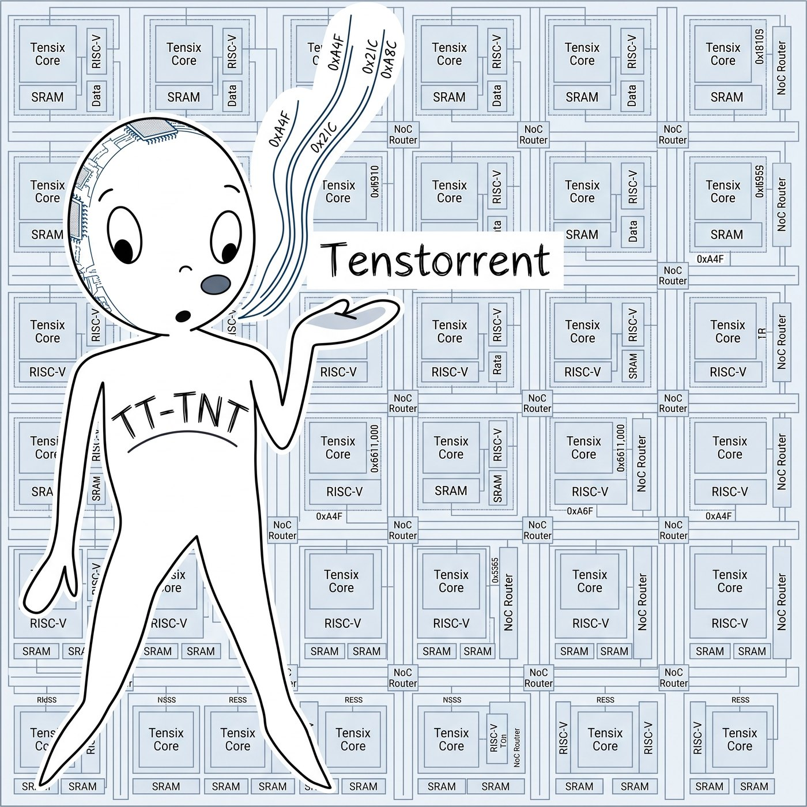

<!-- SPDX-License-Identifier: Apache-2.0 -->
<!-- SPDX-FileCopyrightText: © 2026 Tenstorrent AI ULC -->

# tt-tnt visual identity



A hand-drawn figure with `TT-TNT` on its chest, standing on a grid of Tensix cores,
SRAM and NoC routers, with a hand-lettered *Tenstorrent*. Its skull is open at the
back and there is a die in it.

Supplied by Taylor Singletary; not generated here. Earlier machine-drawn attempts
(an SVG homage to Tortoise's *TNT* sleeve) were discarded.

## Files

| file | size | use |
|---|---|---|
| `tt-tnt-logo-original.jpg` | 2048px | Untouched original, as supplied. |
| `tt-tnt-logo-full.jpg` | 1950px | Cropped master. Everything below derives from it. |
| `tt-tnt-logo.jpg` | 1400px | The site hero, and the Open Graph / Twitter card image. |
| `tt-tnt-logo-small.jpg` | 520px | The README, displayed at 260px. |
| `tt-tnt-mark.png` | 512px | Head and shoulders, for avatars. |
| `../favicon.png`, `../apple-touch-icon.png` | 64 / 180px | Site icons, cut from the same head. |

## The two edits

**The crop.** The original carried a stray `TITLE` placeholder in its top-left
margin. The frame sat inside a uniform 49px border, so cropping to `(49, 49,
1999, 1999)` removes the placeholder and the empty margin in one move and leaves
a square. `tt-tnt-logo-original.jpg` is kept unmodified beside it.

**The mark.** The full drawing is a figure on a die at low contrast; below about
128px the figure dissolves into the grid. The mark is therefore a *different crop*
rather than the same image scaled — head and shoulders, from `(10, 140, 990,
1120)` of the master.

## Where it is used

- `docs/index.html` — hero, beside the lede; also `og:image` and `twitter:image`,
  which is why the card is now `summary_large_image`.
- `README.md` — right-aligned at 260px.

The drawing is light-on-pale, so on the site's dark theme it is dimmed to
`brightness(.9)` and given a `--rule` border. Without that it reads as a lit panel
floating over a dark page.

## The link-preview card

`og-card.jpg` (1200×630), built by `generate_og_card.py`.

The card is declared `summary_large_image`, and every consumer that honours that —
X, Slack, LinkedIn, Discord — crops the image to roughly 1.91:1. Pointing
`og:image` at the square logo therefore ships a band across the figure's torso
with the head and the feet cut off, and nothing anywhere reports it. So the card
is composed at the ratio it is consumed at, with the logo placed inside rather
than cropped by someone else's server.

Rebuild it after any change to the headline or the logo:

```bash
python docs/brand/generate_og_card.py
```
