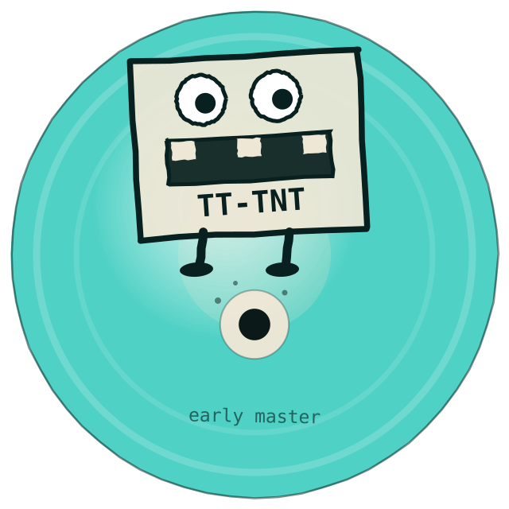

<!-- SPDX-License-Identifier: Apache-2.0 -->
<!-- SPDX-FileCopyrightText: © 2026 Tenstorrent AI ULC -->

# tt-tnt visual identity



## What it is

A cartoon creature — blocky, googly-eyed, gap-toothed — with `TT-TNT` on its chest,
drawn in marker on a burned CD-R, standing over the disc's centre hole with crumbs
around it.

## Where it comes from

Tortoise's *TNT* (1998) is an instrumental record whose sleeve looks like someone
drew a cartoon on a CD-R — an early master of the album rather than a pressing.

That is the spirit of this model, and not as a pose: tt-tnt is 123M parameters
trained for one epoch, whose own measurement suite keeps catching it out. It is an
early master. The disc says so under the creature's feet.

This is an **original homage**, in the manner of `station-to-station.svg` in
tt-station — the spirit of the reference, never its artwork.

## How Tenstorrent is in it

Structurally rather than applied. CD-R dye is cyan-green and the Tenstorrent
accent is teal, so the disc's data field simply *is* the brand colour
(`#4FD1C5`), and the ink is the brand's dark forest (`#08201f`). The creature's
mouth has gaps where teeth should be — the harvested die is 110 usable cores of
204 sites, and the mouth is missing the same way.

## Files

| file | use |
|---|---|
| `tt-tnt-logo.svg` | 640px, with the "early master" line. README, site header, model card. |
| `tt-tnt-mark.svg` | 256px, no wordmark. Favicon, avatar, anywhere under ~96px. |
| `generate_logo.py` | Regenerates both. |

The hand-drawn wobble comes from a **seeded** generator, so the logo is stable
across regenerations. A logo that changes every build is not a logo.

```bash
python docs/brand/generate_logo.py
```
